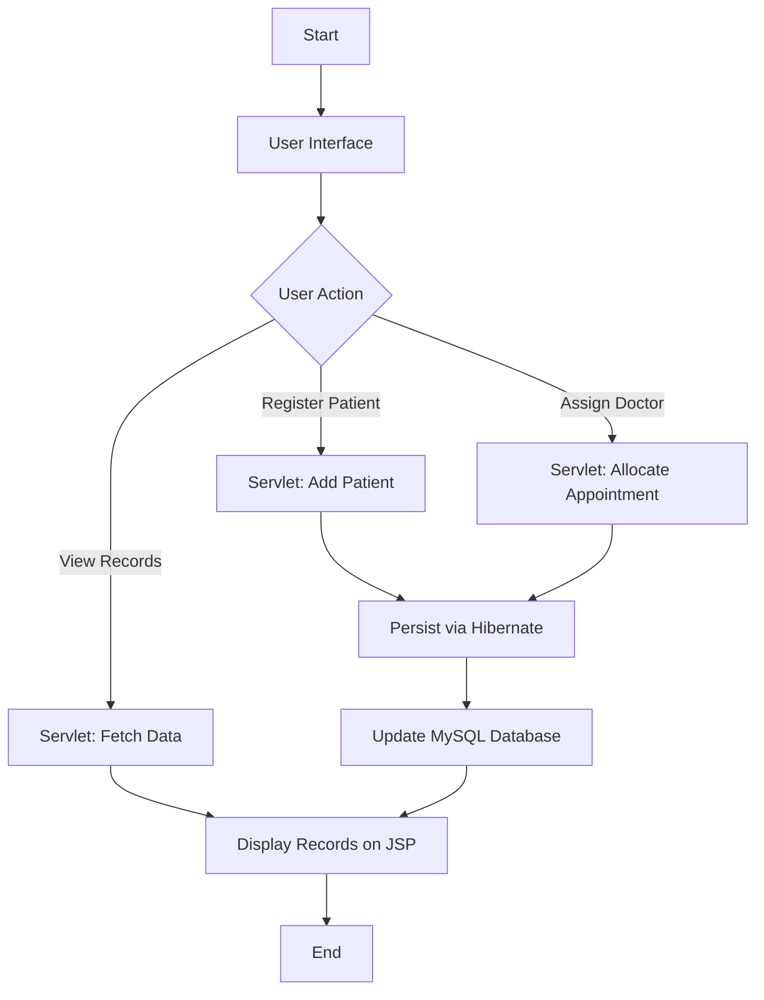
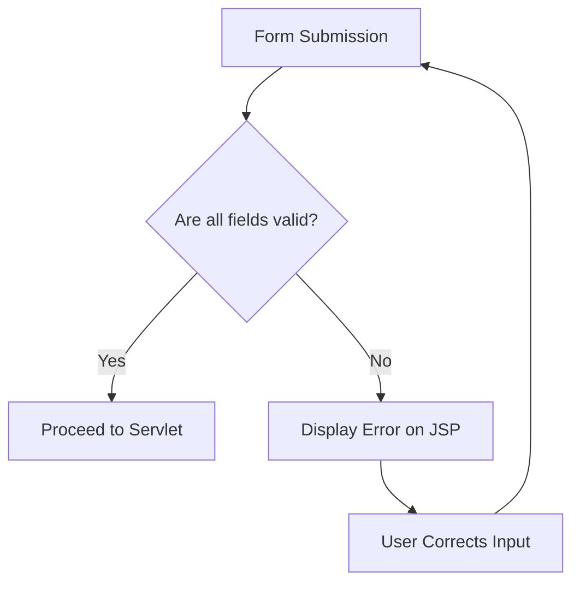

# Hospital-Management-System-JakartaEE

This is a college-level AIP project demonstrating the use of Java enterprise technologies for solving real-world healthcare management challenges. The project showcases the learning outcomes of Jakarta EE, Hibernate ORM, JSP, MySQL, and MVC architecture.  
**Subject Code: 24CAP-652**

## Project Overview

The **Hospital Management System (HMS)** is a web-based application designed to streamline hospital operations such as patient registration, doctor allocation, and appointment tracking. Built using Jakarta EE for the backend and Hibernate for database interactions, the system provides a scalable, efficient, and secure way to manage hospital workflows.

The system aims to reduce manual effort, prevent data duplication, and simplify access to medical records. It features an intuitive interface built with JSP and styled using CSS for a smooth user experience.

## Features

- **Patient Registration**: Add and manage patient records including personal and medical details.
- **Doctor Management**: Register and maintain doctor profiles with their specializations.
- **Appointment Scheduling**: Assign doctors to patients and manage visit details.
- **Data Persistence**: Automatically saves and updates records using Hibernate ORM.
- **Web-based Interface**: Uses JSP and JSTL for dynamic content rendering and user interaction.

## Architecture

The project is structured in a layered architecture as follows:

1. **Presentation Layer (JSP & CSS)**  
   Renders the user interface and collects input via forms.
2. **Business Logic Layer (Jakarta EE Servlets)**  
   Processes requests, manages application flow, and handles validation.
3. **Data Access Layer (Hibernate ORM)**  
   Maps Java objects to MySQL tables and manages CRUD operations.
4. **Database Layer (MySQL)**  
   Stores data related to patients, doctors, and appointments using relational schemas.

### System Flowchart

### Input Validation Decision Tree

## Modules

- **Patient Registration**: Add new patients with demographic and assigned doctor info.
- **Doctor Management**: Maintain doctor records including updates and specializations.
- **Appointment Allocation**: Link patients with doctors and log appointment details.
- **Patient List View**: See all registered patients in a tabular format.
- **Hibernate-Based Data Handling**: Ensures smooth and efficient DB transactions.

## Technologies & Tools Used

- **Jakarta EE** – Backend logic and servlet management  
- **Hibernate** – Object-relational mapping and DB interaction  
- **MySQL** – Relational database for structured data storage  
- **JSP & JSTL** – Frontend UI rendering and dynamic page creation  
- **CSS** – Styling and responsive UI  
- **Apache Tomcat** – Web server for deploying the application  
- **NetBeans IDE** – Development environment  
- **MySQL Workbench** – Database design and queries  

## Expected Outcomes

- Fully functional hospital management system prototype.
- Practical exposure to Java EE, Hibernate, and MVC architecture.
- Real-time patient-doctor management in a user-friendly interface.
- Demonstration of enterprise application development best practices.

## Conclusion

This project serves as a strong foundation in understanding how enterprise Java technologies can solve real-world problems. By integrating Jakarta EE, Hibernate, JSP, and MySQL, it provides a modular, maintainable, and scalable approach to managing hospital operations.

As future enhancements, modules like user authentication, billing, prescriptions, medication tracking, and appointment reminders can be added to evolve the system into a comprehensive hospital ERP solution.
